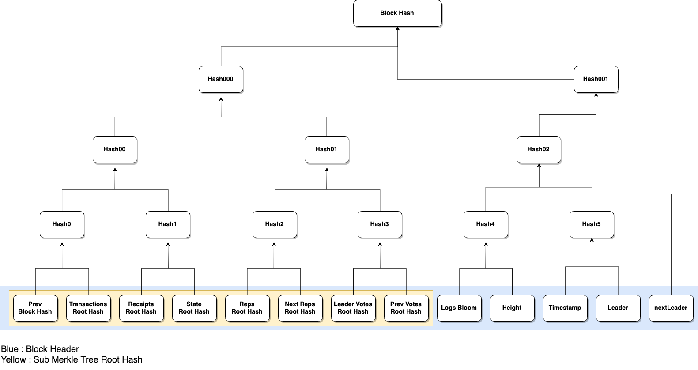

# Block 0.3
Block version 0.3 is a giant merkle tree. It consists of sub merkle trees represented by their root hashes. Even block hash is a root hash of its leaves. So last block hash is a root hash composed of its leaves which contain previous block root hash as a first leaf recursively.



## Proof
Each leaf of blocks can be proven by merkle proof. For example we can get proofs of a transactions root hash to its block hash. Also we can get proofs of one of transactions to its transaction root hash. Then we can get proofs of the transaction to the block hash by bonding two pieces of proofs.
In the same way we can get proofs of genesis transaction to last block.

## Attributes
```json
{
  "version": "0.3",
  "prevHash": "0x1c08c2123831156869a2e6dce1b9761c392da0a54f076737fae33074dc0ef78c",
  "transactionsHash": "0x0000000000000000000000000000000000000000000000000000000000000000",
  "stateHash": "0xa7ffc6f8bf1ed76651c14756a061d662f580ff4de43b49fa82d80a4b80f8434a",
  "receiptsHash": "0x0000000000000000000000000000000000000000000000000000000000000000",
  "repsHash": "0x18cd12bafa5e6eee517ebd95ebf7a31c9252f973dedccb61b4f8e692c5233782",
  "nextRepsHash" : "0x18cd12bafa5e6eee517ebd95ebf7a31c9252f973dedccb61b4f8e692c5233782",
  "leaderVotesHash": "0xe2b91c08409aaf5ea1d83f99356ecf264f3bf6053677a849e1effec71a949b1c",
  "prevVotesHash": "0xffd17ebb7c79a649148ebd77fd35a96f7c8a0ce400f3fee9daabc123780435ca",
  "logsBloom": "0x00000000000000000000000000000000000000000000000000000000000000000000000000000000000000000000000000000000000000000000000000000000000000000000000000000000000000000000000000000000000000000000000000000000000000000000000000000000000000000000000000000000000000000000000000000000000000000000000000000000000000000000000000000000000000000000000000000000000000000000000000000000000000000000000000000000000000000000000000000000000000000000000000000000000000000000000000000000000000000000000000000000000000000000000000000000",
  "timestamp": "0x58aef981a3448",
  "transactions": [],
  "leaderVotes": [
    null,
    {
      "rep": "hx9f049228bade72bc0a3490061b824f16bbb74589",
      "timestamp": "0x58aef980a0808",
      "blockHeight": "0x4",
      "oldLeader": "hx86aba2210918a9b116973f3c4b27c41a54d5dafe",
      "newLeader": "hx9f049228bade72bc0a3490061b824f16bbb74589",
      "signature": "3A3hlPq4HoGaWWvrOYRpxV4L242bpJHSWlOPSNWBRvAQDPgglW1h1LPcntBc/+KH8Gz4W1GlrfomIOfWjddYGQE="
    },
    {
      "rep": "hx6435405122df9fe5187d659588beccdf7aee8557",
      "timestamp": "0x58aef9819dbce",
      "blockHeight": "0x4",
      "oldLeader": "hx86aba2210918a9b116973f3c4b27c41a54d5dafe",
      "newLeader": "hx9f049228bade72bc0a3490061b824f16bbb74589",
      "signature": "fPSqkozXMthwmPbHXJLRBhkPaBPHo5NPZUF6GHgtEZo07KvXmT+fzMEdprs5AaPyME+LVc/Vt4rH6KdDyw7e/gE="
    },
    {
      "rep": "hx475bfec4178f3abc88c959faa2e6384e6b409c8f",
      "timestamp": "0x58aef9819ab2f",
      "blockHeight": "0x4",
      "oldLeader": "hx86aba2210918a9b116973f3c4b27c41a54d5dafe",
      "newLeader": "hx9f049228bade72bc0a3490061b824f16bbb74589",
      "signature": "9H2Kq+nnEwoExvgK8Acv0G4+9KSQ2Z9D72jzqjFg/OFw38KXDtMt0AHsnu7IWBC0ZZvw2SJl+TmhmC9T8zu4jAE="
    }
  ],
  "prevVotes": [
    {
      "rep": "hx86aba2210918a9b116973f3c4b27c41a54d5dafe",
      "timestamp": "0x58aef8a392865",
      "blockHeight": "0x3",
      "blockHash": "0x1c08c2123831156869a2e6dce1b9761c392da0a54f076737fae33074dc0ef78c",
      "signature": "8W1qG1O7ksK2gpb1ci6n/zx+TTvJ8lGz+etC+yhjKgNWdI2mh1F2cOxcBOxCMsdClita84gAPKMPtXnUnmvwswA="
    },
    {
      "rep": "hx9f049228bade72bc0a3490061b824f16bbb74589",
      "timestamp": "0x58aef8a3abcdb",
      "blockHeight": "0x3",
      "blockHash": "0x1c08c2123831156869a2e6dce1b9761c392da0a54f076737fae33074dc0ef78c",
      "signature": "v9EYWeA6SPrxHGxYFCLQWdZ0/5i29w+JXiAzk0gnUyl9ppajL3Hig/wzrc+grMm0is5N8GiuITZMugP74dnl1wE="
    },
    {
      "rep": "hx6435405122df9fe5187d659588beccdf7aee8557",
      "timestamp": "0x58aef8a3ae9b8",
      "blockHeight": "0x3",
      "blockHash": "0x1c08c2123831156869a2e6dce1b9761c392da0a54f076737fae33074dc0ef78c",
      "signature": "vaqJNYgkMFzHdpKYULUYj8HKMlqEZc2IDHQCFqOV14EucQWjEm/qBqhxngMuPzBcDz/I3yWpqY28poP18MlMIgA="
    },
    {
      "rep": "hx475bfec4178f3abc88c959faa2e6384e6b409c8f",
      "timestamp": "0x58aef8a3ae16d",
      "blockHeight": "0x3",
      "blockHash": "0x1c08c2123831156869a2e6dce1b9761c392da0a54f076737fae33074dc0ef78c",
      "signature": "g6tKeCbVcKDLmdTtISP2W/lPvXo6W2vEA8tK/ikxWtIz0mXD49wPLoLk5aD6mm0M1SFdZhEoVdmxurGfc0q7OgA="
    }
  ],
  "hash": "0xc60d6db8bc631de7755abeb713532b8def0a9268cd9078c0e631536065d68a06",
  "height": "0x4",
  "leader": "hx9f049228bade72bc0a3490061b824f16bbb74589",
  "signature": "vf7lj+Sri9Vxno8TQBhLTFiNq3mJIYtwUNvk4xq5xH4skTnA49wcFUykCl6aTPoIkMI8mAA1HE5Vdn9nRdgjbQE=",
  "nextLeader": "hx9f049228bade72bc0a3490061b824f16bbb74589"
}
```

- version
  - Block version
- hash
  - Block hash
  - Merkle root hash of leaves(Header attributes)
  - Signature and Hash itself are excluded from generating hash
- prevHash
  - Previous block hash
- prevVotesHash
  - Merkle root hash of votes for previous block
- leaderVotesHash
  - Merkle root hash of votes for new leader
- transactionsHash
  - Merkle root hash of transactions in the block
- stateHash
  - Root hash of global state
- receiptsHash
  - Merkle root hash of transaction receipts in the block
- repsHash
  - Merkle root hash of reps for this block
- nextRepsHash
  - Merkle root hash of reps for next block
- logsBloom
  - Merged logs bloom of transactions results
- timestmap
  - Block generation time(μs)
- height
  - Block height
- leader
  - Generator of this block
- nextLeader
  - Generator of next block
- signature
  - Signed value to block hash by leader rep
- transactions
  - trnasctions in this block
- prevVotes
  - Votes for previous block
- leaderVotes
  - Votes for new leader